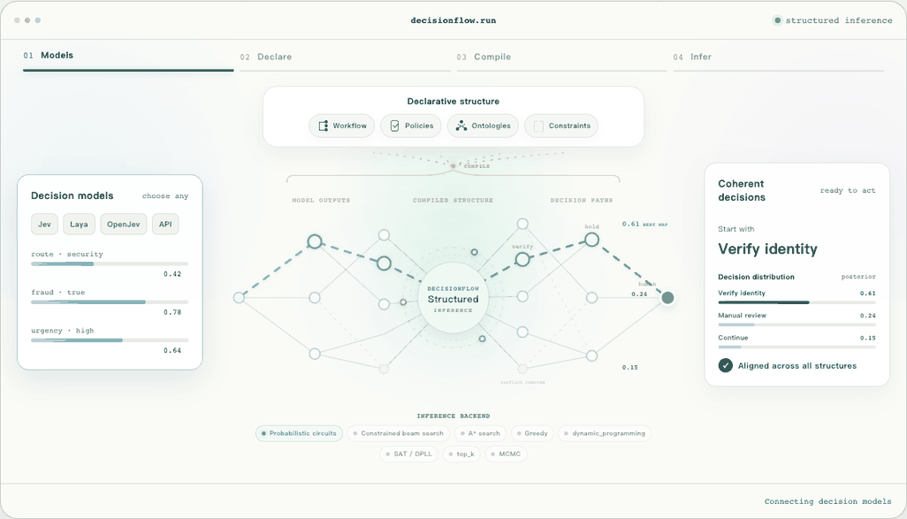

<p align="center">
  
</p>

<p align="center"><strong>Turning local judgments into globally coherent decisions—fast.</strong></p>

<p align="center">
  Open infrastructure for modeling complete decision flows, from local model
  scores to coherent multi-step decisions.
</p>

<p align="center">
  <a href="#install">Install</a> ·
  <a href="#interactive-demo">Interactive demo</a> ·
  <a href="#declarative-workflow">Workflow</a> ·
  <a href="#python-api">Python API</a> ·
  <a href="docs/inference-backends.md">Inference backends</a>
</p>

<p align="center">
  <picture>
    <source srcset="assets/decisionflow-demo-hd.webp" type="image/webp" />
    
  </picture>
</p>

DecisionFlow compiles declarative business workflows and decision policies into
structured probabilistic decision flows. Users choose a decision model, provide
a JSON or YAML workflow, and select an inference backend. The compiler creates
the typed questions, reachable branches, state transitions, and complete
decision worlds required for joint inference.

```text
initial state + declarative workflow + policies
                         │
decision model ──> WorkflowCompiler
                         │
              StructuredDecisionFlow IR
                         │
 greedy · A* · beam · DP · SAT · exact · PC · sampling
                         │
       complete flow · MAP · marginals · valid mass
```

Probabilistic circuits are one inference backend. They do not define the public
API or the workflow representation.

## Interactive demo

The service-ticket demo makes the full inference loop visible: adjust four
local typed-decision distributions, enable or disable business policies, and
watch the valid mass, joint MAP, valid worlds, and constraint-conditioned
marginals update together.

```bash
python3 -m http.server 8080 --directory site
```

Open `http://localhost:8080/demo.html`. The demo is dependency-free and runs
exact enumeration over its 36 decision worlds directly in the browser.

## Install

```bash
pip install "decisionflow @ git+ssh://git@github.com/xiongbo010/DecisionFlow.git@v0.1.0"
pip install "decisionflow[sdd] @ git+ssh://git@github.com/xiongbo010/DecisionFlow.git@v0.1.0"
```

The repository is currently private, so installation from Git requires GitHub
access. A downloaded release wheel can also be installed with
`pip install decisionflow-0.1.0-py3-none-any.whl`. For local development, clone
the repository and run `pip install -e '.[dev]'`.

## Declarative workflow

```yaml
name: service-ticket
version: 1
start: classify
max_steps: 3

steps:
  classify:
    questions:
      - id: route
        type: choice
        instruction: Which department should handle the ticket?
        options: [billing, security]
      - id: fraud
        type: noul
        instruction: Does the ticket indicate fraud?
    transitions:
      - name: possible-fraud
        when: {eq: [{var: fraud}, true]}
        goto: review
        set: {queue: {const: security}}
      - name: ordinary-ticket
        otherwise: true
        goto: resolved
        set: {queue: {var: route}}

  review:
    questions:
      - id: action
        type: choice
        options: [freeze, dismiss]
    transitions:
      - otherwise: true
        goto: resolved

  resolved:
    terminal: true

constraints:
  hard:
    - name: fraud-routes-security
      expr:
        implies:
          - {eq: [{var: classify.fraud}, true]}
          - {eq: [{var: classify.route}, security]}
    - name: fraud-cannot-be-dismissed
      expr:
        implies:
          - {eq: [{var: classify.fraud}, true]}
          - {eq: [{var: review.action}, freeze]}
```

The compiler namespaces generated variables by step and visit, such as
`classify@0.route` and `review@1.action`. Stable names such as
`classify.route` are available in policies. Variables in inactive branches use
the explicit `__inactive__` value during marginal inference.

## Python API

```python
from decisionflow import DecisionFlow
from decisionflow.scorers import TypedResponseScorer

model = TypedResponseScorer(call_your_model_sdk)

flow = DecisionFlow(
    model=model,
    workflow="service-ticket.yaml",
    policies="company-policies.yaml",       # optional
    backend="pc",
)

result = flow.infer({"ticket_id": "T-104", "status": "open"})

print(result.flow)             # selected complete decision flow
print(result.prediction)       # generated typed decisions
print(result.marginals)        # when supported by the backend
print(result.valid_mass)       # when supported by the backend
```

The constructor is the public configuration boundary:

```text
DecisionFlow(model, workflow, policies, backend, backend_options, max_worlds)
```

Runtime calls supply the initial business state. A backend can also be
overridden for one call:

```python
greedy = flow.infer(state, backend="greedy")
sampled = flow.infer(
    state,
    backend="sampling",
    backend_options={"samples": 50_000, "seed": 7},
)
```

## Inference methods

| Backend | Output | Exact |
|---|---|---:|
| `greedy` | local point-prediction flow and policy violations | no |
| `a_star` / `astar` | maximum-probability feasible flow | yes |
| `beam_search` / `beam` | finite-width approximate MAP flow | no |
| `dynamic_programming` / `dp` | valid mass, marginals, and joint MAP | yes |
| `sat` | an arbitrary feasible flow | yes for feasibility |
| `enumeration` / `auto` | valid mass, marginals, and joint MAP | yes |
| `pc` / `sdd` | valid mass, marginals, and joint MAP | yes |
| `top_k` | truncated marginals and MAP | no |
| `sampling` | estimated valid mass, marginals, and observed MAP | no |

Each result reports its capabilities. Marginals and valid mass are optional
outputs rather than requirements imposed on every inference method.

The v0.1 A* implementation uses the admissible zero heuristic, making it an
exact uniform-cost search under negative log-probability. SAT uses a CNF
encoding and a dependency-free DPLL solver; it ignores model probabilities and
answers feasibility. DP runs sum-product and max-product recursions on the
compiled prefix DAG.

The v0.1 PC backend performs an exact categorical-world SDD lowering after
finite workflow compilation. A structural workflow-to-circuit lowering can
replace it later without changing the workflow schema or public API.

See [`docs/inference-backends.md`](docs/inference-backends.md) for backend
contracts and extension points.

## Decision models

DecisionFlow remains model-provider neutral. A model implements:

```python
score(DecisionRequest) -> LocalPotentials
```

The compiler calls it only for reachable workflow nodes. Existing adapters
support cached probabilities, Python callables, Jev-style responses, HTTP
services, local models, and hosted APIs.

## Agent tool and CLI

```python
from decisionflow import DecisionFlowTools

tools = DecisionFlowTools(model=model, workflow="service-ticket.yaml")
output = tools.call("decisionflow_run", {"state": current_ticket})
```

The provider-neutral tools are `decisionflow_run` and
`decisionflow_backends`.

```bash
decisionflow run examples/service-ticket-workflow.yaml \
  examples/service-ticket-state.json \
  --model examples.service_ticket_model:model \
  --backend pc

decisionflow backends
```

## Core and experiments

The reusable Core owns workflow parsing, compilation, model scoring, structured
IR, and inference. Dataset loading, benchmark prompts, cached scores, metrics,
and paper tables remain in [`experiments/`](experiments/). Legacy pilots use the
internal grounded-decision engine while they are migrated to declarative
workflow files; no dataset-specific behavior is imported by Core.

## v0.1 boundaries

- Candidate domains and workflow horizons are finite.
- Loops require `max_steps`; truncated paths remain visible as incomplete worlds.
- Transitions use ordered first-match semantics, with an optional `otherwise`.
- State updates are declarative assignments to mapping paths.
- The compiler currently materializes finite worlds and their shared prefix
  graph before inference. Search and DP operate on the graph; SAT and PC lower
  the finite worlds to their solver representations. The IR allows later lazy
  expansion without changing the user-facing workflow.
- Stochastic environment outcomes, utilities, parallel steps, and multi-agent
  ownership remain planned workflow-schema extensions.
