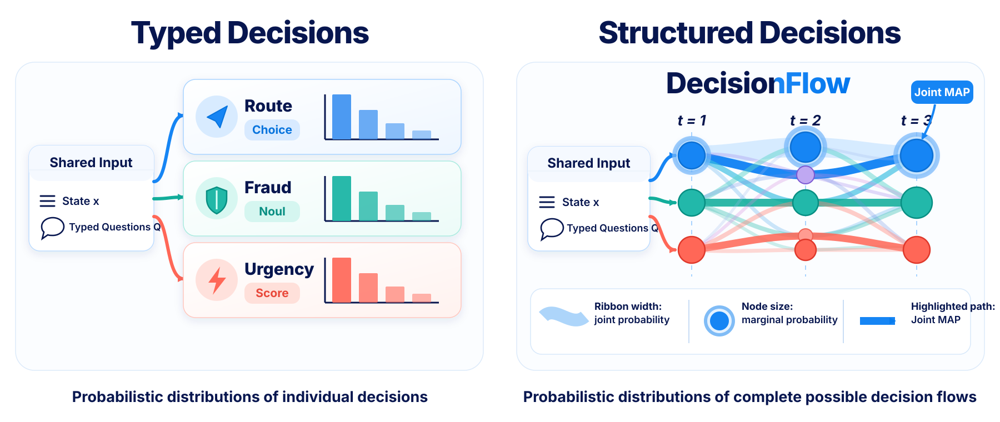

# DecisionFlow v0.0



DecisionFlow models probability over complete structured decisions. It combines
local predictions into a joint distribution over multiple decisions or
multi-step trajectories, where each complete assignment represents a possible
decision world. The same model supports exact marginals, joint MAP, trajectory
probabilities, and consistency mass under optional hard or soft constraints.

The model layer is provider-neutral: it works with hosted APIs, local models,
Python callables, or precomputed probabilities. Constraint frontends and
inference backends remain independently extensible.

The v0.0 pipeline is:

```text
state + typed questions ──> scorer adapter ──> local probabilities
      │                                      │
JSON constraints ──> JSON frontend ──> decision program
                                             │
                    joint model ──> enumeration / SDD
                                             │
              marginals · joint MAP · trajectories · valid mass Z
```

```bash
pip install -e .
pip install -e '.[sdd]'   # optional scalable SDD backend
```

```python
from decisionflow import DecisionFlow

request = {
    "state": {"channel": "card"},
    "questions": [
        {"id": "route", "type": "choice", "options": ["billing", "security"]},
        {"id": "fraud", "type": "noul"},
    ],
    "probabilities": {
        "route": {"billing": 0.6, "security": 0.4},
        "fraud": {"false": 0.3, "true": 0.7},
    },
}
constraints = {
    "hard": [{
        "name": "fraud-routes-to-security",
        "expr": {"implies": [
            {"eq": [{"var": "fraud"}, True]},
            {"eq": [{"var": "route"}, "security"]}
        ]}
    }]
}

result = DecisionFlow(backend="auto").infer(request, constraints)
print(result.marginals)
print(result.joint_map)
print(result.valid_mass)
```

`backend="auto"` uses the transparent enumeration oracle for small spaces and
the optional SDD backend for larger spaces. The SDD backend compiles the rule
structure once, caches it, and changes only the model-provided leaf weights on
later requests with the same grounded structure.

## Model adapters

DecisionFlow does not import a particular model SDK. Configure one of these
provider-neutral adapters and pass it to `DecisionFlow(scorer=...)`:

- `PrecomputedScorer` for cached experiment outputs;
- `CallableScorer` for a local Python model;
- `TypedResponseScorer` for Jev-style `answers` returned by any SDK;
- `HttpJsonScorer` for a local server or hosted endpoint.

Custom scorers implement one method: `score(DecisionRequest) -> LocalPotentials`.
This boundary supports OpenJev, JevAny, locally hosted models, and closed APIs
without provider code in the inference core.

## Agent tool calls

```python
from decisionflow import DecisionFlow, DecisionFlowTools
from decisionflow.scorers import TypedResponseScorer

scorer = TypedResponseScorer(call_your_model_sdk)
tools = DecisionFlowTools(DecisionFlow(scorer=scorer, backend="auto"))

# Register tools.schemas with the agent provider, then dispatch its tool call:
output = tools.call(tool_name, tool_arguments)
```

The registered tools are `decisionflow_infer`, `decisionflow_evaluate`, and
`decisionflow_trajectory`. Their inputs and outputs contain only JSON-compatible
objects.

The JSON CLI accepts one request or JSONL batches:

```bash
decisionflow infer request.json --constraints policy.json
decisionflow evaluate requests.jsonl --constraints policy.json --output results.jsonl
decisionflow trajectory trajectory.json
```

See `docs/json-format.md` for the v0.0 interchange format.

## Constraint coverage

The JSON frontend supports Boolean composition, implications, equivalence,
comparisons, set membership, cardinality, hard rules, and weighted soft rules.
An `allowed_table` or `forbidden_table` can represent any grounded finite
relation. Consequently, a workflow engine, SOP parser, policy system, ontology
reasoner, or temporal-rule compiler can remain outside the core and submit its
grounded relation through the same interface.

## Regression coverage

Core regression tests cover every decision structure used in the current
pilots:

| Experiment family | Typed structure exercised |
|---|---|
| OpenAI Moderation | eight Boolean decisions and hierarchical implications |
| ToxiGen | Boolean plus ordinal Score |
| GoEmotions | 28 Boolean decisions and mutual exclusion |
| ToxicChat | two Boolean decisions and implication |
| HelpSteer2 | five ordinal Scores with hard and soft rules |
| Typed Decisions | heterogeneous Choice, Noul, and Score requests |
| SOP-Bench | finite SOP relations, state evidence, and multi-step policies |
| JevAny control panel | finite-horizon action/transition constraints |

Dataset acquisition, prompting, benchmark metrics, and paper tables live in
the separate [`experiments/`](experiments/) package. That package depends on
DecisionFlow and calls only its public API; DecisionFlow never imports it. The
library therefore contains no dataset-specific branches, labels, prompts, or
paper-reproduction commands. Local legacy pilots remain ignored provenance
material while their score-generation paths are migrated.

This separation also applies to command-line interfaces:

- `decisionflow infer|evaluate|trajectory` is the reusable product CLI;
- `decisionflow-experiments verify|run` belongs to the research package.

## v0.0 boundaries

- All candidate domains are finite.
- The SDD backend currently accepts the independent local-potential joint. The
  `JointBuilder` interface reserves directed and learned joint models; arbitrary
  joint builders already work with the enumeration backend.
- Multi-step inference uses an explicit finite state graph and separates action
  probabilities from stochastic environment transitions.
- Ontologies, SOPs, and policy languages require an external grounding step to
  DecisionFlow JSON expressions or finite tables.
- The cache is process-local; persistent circuit artifacts and a network
  service are reserved interfaces for later releases.
